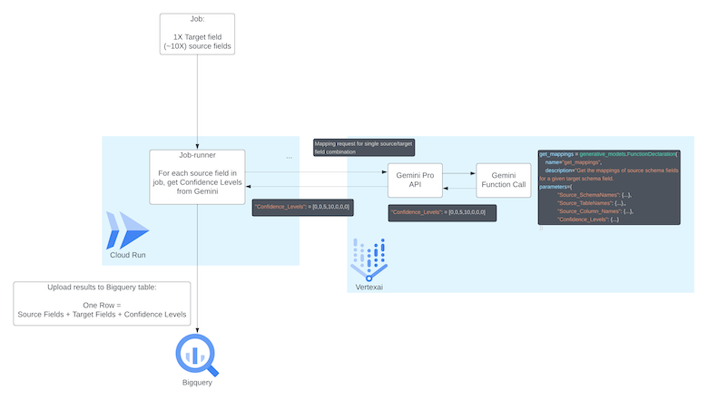
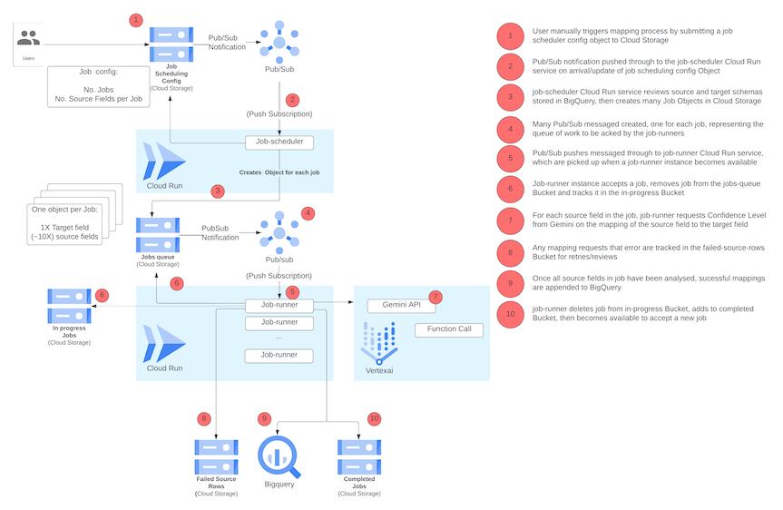

# Gemini-powered Source to Target data schema mapping PoC

This project provides a Proof of Concept for using Gemini Pro to assist with mapping source schema fields to target schema fields in the situation of a data migration event. 

**Please note that this is A DEMO, showing the art of the possible under very time constrained conditions. It has been built for speed and not for reliability, performance or any other considerations required for a robust production system. Only use it as inspiration to understand what sorts of architectures are possible. Always start from scratch with your own implementation.**

The lightweight architecture enables parallelising multiple requests to Gemini Pro, enabling either one:one or many:one source:target mapping evaluations.

*   For any single Mapping evaluation, the request is sent to Gemini Pro, where Function Calling is used to ensure a more consistent response back from Gemini, enabling the downstream steps of collating all mapping evaluations and uploading results into BigQuery.

<br>

<br>

*   For the parallelisation, Cloud Run is used as the runtime enviornment for a small subset of mapping requests, and configured to run a fleet of Instances in a single Service (job-runner), each of which picks a and processes a single mapping request from a job queue.
*   The Jobs are configured by a seperate Cloud Run Service (job-scheduler), where a configurable input provided by and end user specifies the way in which the total combinations of many:many source:target mapping request possibilities should be split up, then the job-scheduler Service packages up the source/target combinations into seperate lists, saved as objects in a Cloud Storage Bucket (queued-jobs). It is from this Bucket that Jobs are picked and processed by the (job-runner) service

<br>

<br>

### Project Structure 

| Folder                      | Description |
|-----------------------------|-------------|
| [Infrstructure](./infrastructure) | This contains all Terraform to build out the Infrastructure |
| [job-runner](./job-runner) | Source code for the job-runner Services, deisgned to run in Cloud Run |
| [job-scheduler](./job-scheduler) | Source code for the job-scheduler Service, deisgned to run in Cloud Run |
| [cloudbuild](./cloudbuild) | config files read by Cloud Build as part of the CI/CD setup |

<br>

### Experimentation

Left in the repo is [experimentation.ipynb](./experimentation.ipynb) used for very early experimentation and testing. Although this code is not up to date, it may still be useful for testing purposes by users of this repo. Please be aware that this code does not represent the most up to date versions of the project, and instead users should refer to [job-scheduler/main.py](./job-scheduler/main.py) and [job-runner/main.py](./job-runner/main.py) and adjust the experimenting notebook appropriately.


### Infrastructure Deployment


Terraform will build out the architecture, running the Terraform from Cloud Build. Cloud Build Triggers will be created later in the readme and through Terraform so any code pushed to your cloned repo (on main branch by defulat) will trigger the Terraform to be checked and any changes to be rolled out.

Terraform initially creates the job-runner and job-scheduler Cloud Run Services using a placeholder container image. Then changes to the [job-scheduler](./job-scheduler) and/or [job-runner](./job-runner) source codes will also trigger an image build and (re-)deployment of these images to the respective services.

0. Setup your own repo. You will need to clone this repo and establish your own connection from that repo to Cloud Build. The project assumes using a GitLab source repo. You can connect Cloud Build to GitLab by following [these](https://cloud.google.com/build/docs/automating-builds/gitlab/connect-repo-gitlab) instructions. For using another type of repo, you will need to adjust the source code accordingly.

1. Setup Environment Variables

Edit the below with your own details:

```
PROJECT_ID=<YOUR-PROJECT-NUMBER>
REGION=us-central1
TF_STATE_BUCKET_NAME=$PROJECT_ID-tf-state
GITLAB_HOST_CONNECTION_NAME=<THIS IS THE NAME OF THE CONNECTION CREATED IN STEP 0>
REPO_NAME=<THIS IS THE NAME OF THE GITLAB REPO CONNECTED VIA STEP 0>
DATASET_ID=<BigQuery Dataset ID TO HOLD THE DATA>
RAW_TARGET_TABLE=<TABLE NAME FOR EXISTING INITIAL TARGET DATA>
TARGET_TABLE=<CHOSEN NAME FOR NEW TABLE FOR TARGET DATA>
RAW_SOURCE_TABLES=<COLON SEPERATED TABLE NAMES FOR EXISTING INITIAL SOURCE DATA - e.g. source-uipetmis:source-uispet>
RAW_SOURCE_TABLES_WILDCARD=<WILDCARD FOR SOURCE TABLES - e.g. source-* >
SOURCE_TABLE=<CHOSEN NAME FOR NEW TABLE FOR SOURCE DATA>
MAPPED_TABLE=<CHOSEN NAME FOR NEW TABLE FOR MAPPED DATA>
```

3. Enable APIs

```
gcloud config set project $PROJECT_ID
PROJECT_NUMBER=$(gcloud projects describe $PROJECT_ID --format 'value(projectNumber)')

gcloud services enable iam.googleapis.com cloudbuild.googleapis.com storage.googleapis.com cloudresourcemanager.googleapis.com compute.googleapis.com dns.googleapis.com
```

4. Create GCS Bucket for the Terraform Init state

```
gsutil mb gs://$TF_STATE_BUCKET_NAME
gsutil versioning set on gs://$TF_STATE_BUCKET_NAME
```

5. Grant Cloud Build additional permissions to permission to manage the Project

```
cp "cloudbuild-iam.example.sh" "cloudbuild-iam.sh"

# For Windows machines:
# sed -i "s/YOUR_GCP_REGION/$GCP_REGION/g" "cloudbuild-iam.sh"
# sed -i "s/YOUR_PROJECT_ID/$GCP_PROJECT_ID/g" "cloudbuild-iam.sh"
# sed -i "s/YOUR_CLOUD_SOURCE_REPO_NAME/$CLOUD_SOURCE_REPO_NAME/g" "cloudbuild-iam.sh"

# For non-Windows machines:
sed -i.bak "s/YOUR_PROJECT_ID/$GCP_PROJECT_ID/g" "cloudbuild-iam.sh"
sed -i.bak "s/YOUR_GCP_REGION/$GCP_REGION/g" "cloudbuild-iam.sh"
sed -i.bak "s/YOUR_CLOUD_SOURCE_REPO_NAME/$CLOUD_SOURCE_REPO_NAME/g" "cloudbuild-iam.sh"
rm "cloudbuild-iam.sh.bak"
```

```
. cloudbuild-iam.sh
```

6.  Apply the Build Trigger for the infrastructure (run command from the repo root )

```
gcloud beta builds triggers create gitlab --name=tf-apply --region=$REGION --repository="projects/$PROJECT_ID/locations/$REGION/connections/$GITLAB_HOST_CONNECTION_NAME/repositories/$REPO_NAME" --branch-pattern=main --build-config=data-mapping-poc/cloudbuild/infrastructure/cloudbuild.yaml --included-files=data-mapping-poc/infrastructure/** --substitutions _GITLAB_HOST_CONNECTION_NAME_=$GITLAB_HOST_CONNECTION_NAME,_REPO_NAME_=$REPO_NAME,_PROJECT_ID_=$PROJECT_ID,_REGION_=$REGION,_TF_STATE_BUCKET_NAME_=$TF_STATE_BUCKET_NAME,_DATASET_ID_=$DATASET_ID,_RAW_TARGET_TABLE_=$RAW_TARGET_TABLE,_TARGET_TABLE_=$TARGET_TABLE,_RAW_SOURCE_TABLES_=$RAW_SOURCE_TABLES,_RAW_SOURCE_TABLES_WILDCARD_=$RAW_SOURCE_TABLES_WILDCARD,_SOURCE_TABLE_=$SOURCE_TABLE,_MAPPED_TABLE_=$MAPPED_TABLE
```

7. Run the Build Trigger for the infrastructure

```
gcloud builds triggers run tf-apply --region=$REGION --project=$PROJECT_ID --branch=main
```

7. Run the Build Trigger for the job-runner

```
gcloud builds triggers run job-runner-build-deploy --region=$REGION --project=$PROJECT_ID --branch=main
```

9. Run the Build Trigger for the job-scheduler

```
gcloud builds triggers run job-scheduler-build-deploy --region=global --project=$PROJECT_ID --branch=main
```